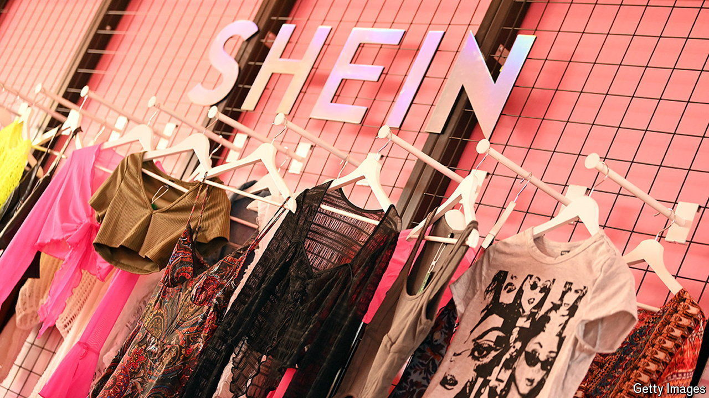

###### Shein on?

# The potential listing of Shein is a test of London’s allure 

##### It would also intensify scrutiny of the fast-fashion giant 

 

> Jul 16th 2024 

At its peak in 2005 the London Stock Exchange (LSE) attracted nearly one in five companies that went public globally. In 2023 that share was around 1% (see chart 1). To arrest  the City’s regulators are loosening listing rules. And to show that it can still be a venue for blockbuster debuts, the LSE is chasing what would be its biggest-ever initial public offering (IPO)—for , a fast-fashion giant and one of the most valuable startups in the world. 

There’s a lot on the line. The LSE needs fast-growing companies to list there, but also wants to avoid being seen as a dumping-ground for contentious firms. By becoming a public company, Shein means to subject itself to more intensive levels of scrutiny. Each would hope to burnish the other’s reputation. The risk is that the shine comes off them both. “It’s a fertile environment for something bad to happen,” says one analyst. 

