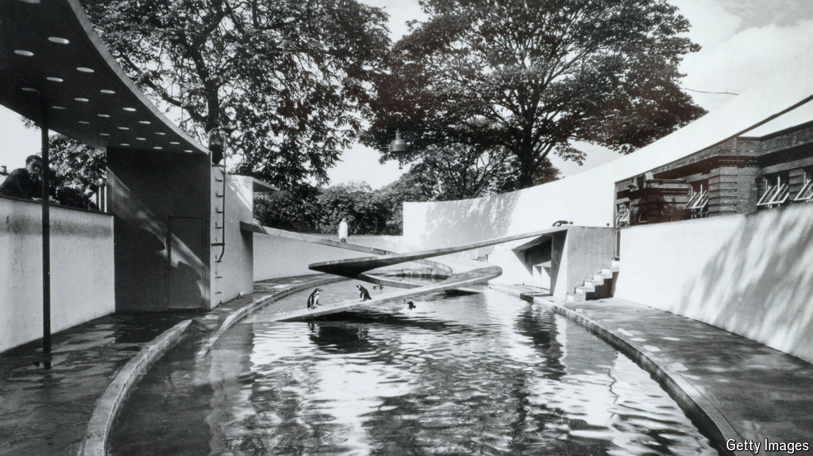

###### Penguins v modernism

# Why do penguins struggle with modernist architecture? 

##### An empty pool at London Zoo tells a wider story 

 

> Jul 14th 2024 

Set between the llamas and the Land of the Lions, the penguin pool in London Zoo is a mini-modernist masterpiece. Built in 1934 and designed by Berthold Lubetkin, it is sleek, swooshy and perfectly proportioned; its cantilevered concrete ramps, slender as apple peelings, were revolutionary. Its penguins looked less as though they were living in it than, as in an architect’s illustration, modelling for it. There was just one problem with this piece of modernist perfection. The penguins didn’t like it. 

