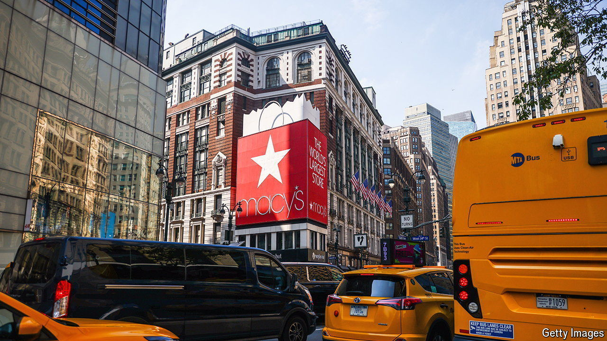

###### Shop lifting

# Can anyone save Macy’s? 

##### America’s biggest department store has rejected a takeover. Now what? 

 

> Jul 18th 2024 

In the 1990s Macy’s, a chain of department stores based in New York, began gobbling up rivals across America. By the late 2000s that strategy had turned it into the biggest fish in a steadily evaporating pond. Sales across American department stores fell from $232bn in 2000 to $133bn last year as consumers switched to buying their frocks and fridges online. Many of Macy’s rivals have collapsed along the way. Sears, once America’s largest retailer, went bankrupt in 2018. JCPenney followed in 2020, as revenues dried up amid lockdowns. Recent years have brought little relief. The surge in the cost of living has led shoppers to seek cheaper alternatives to department stores.

The future of Macy’s has been in question since December, when Arkhouse Management and Brigade Capital Management, two buy-out firms, were reported to be circling the retailer. After their takeover offer valuing it at $5.8bn was rejected in January, the duo began to agitate for a shake-up of its board. Macy’s then agreed to talks on a sweetened proposal and handed two seats on its board to the interlopers. On July 15th, however, it called off discussions, blaming uncertainty over how the deal would be financed. Its share price plummeted by 12%, lowering its market value to $4.7bn.

