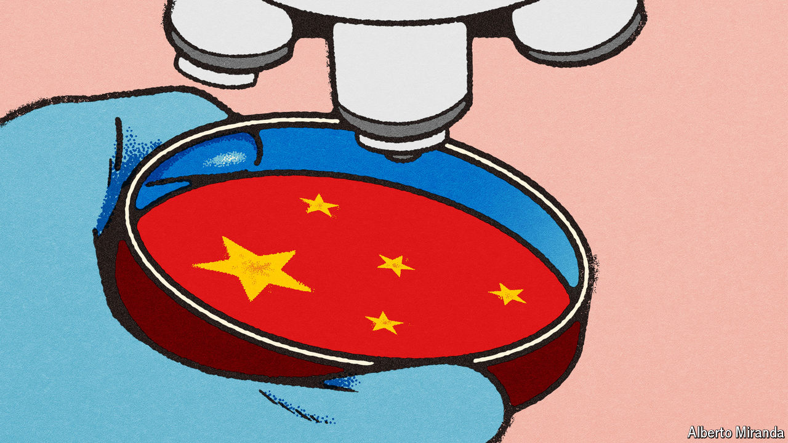

###### Research developments

# China is the West’s corporate R&D lab. Can it remain so? 

##### Foreign firms want Chinese boffins. America and China may have other plans 

 

> Jul 18th 2024 

CHINA IS, FAMOUSLY, the world’s factory and a giant market for the world’s companies. More unremarked is its growing role as the world’s research-and-development laboratory. Between 2012 and 2021 foreign firms increased their collective Chinese research personnel by a fifth, to 716,000. Their annual R&amp;D spending in the country almost doubled, to 338bn yuan ($52bn). Add investments by local firms and China now matches Europe’s R&amp;D tally (see chart). Only America splurges more.

