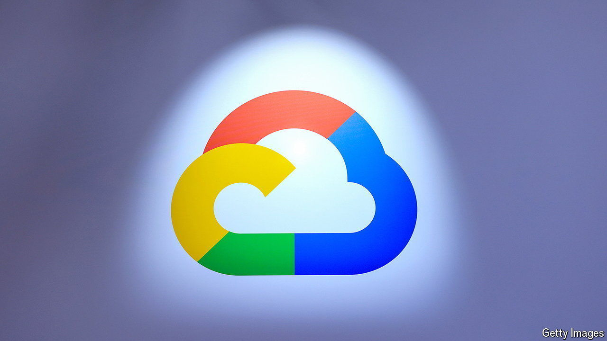

###### Wiz kid

# Google wants a piece of Microsoft’s cyber-security business 

##### A $23bn acquisition of Wiz, an Israeli startup, is the search giant’s biggest ever 

 

> Jul 18th 2024 

IN LATE 2022 Wiz, a cyber-security startup, boasted that it was “the fastest-growing software company ever”. A stretch, maybe, but not a big one. At that point, 18 months after it was founded, annualised sales hit $100m. By 2023 they were $350m. In May Wiz raised $1bn at a $12bn valuation. On July 14th it emerged that Alphabet, Google’s parent company, was in talks to acquire Wiz for $23bn. It would be the biggest purchase of a cyber-security firm in history and Alphabet’s biggest takeover ever (see chart 1).

