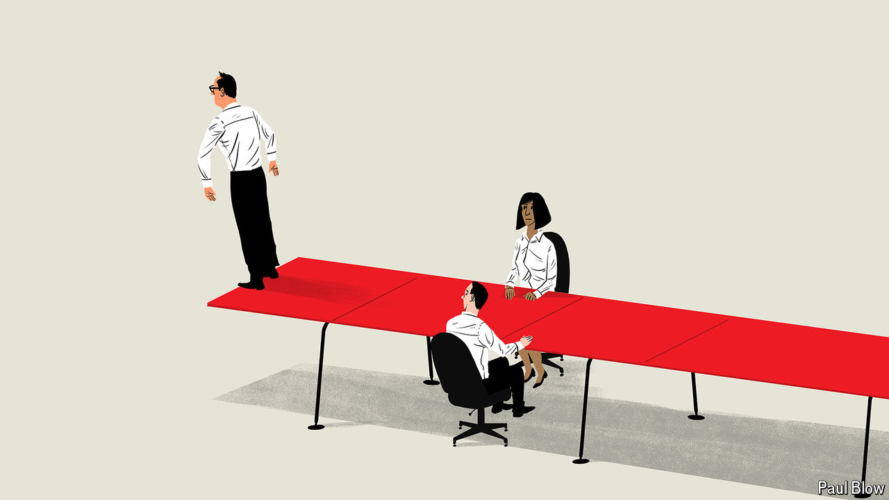

###### Bartleby

# How a CEO knows when to quit 

##### Bosses have a shelf life and plenty of incentives to misjudge what it is 

 

> Jul 18th 2024 

Deciding to CAlL it quits is a relatively simple judgment early on in a career. If you find the prospect of going to work on Monday morning more depressing than a Lars von Trier film, it is time to leave. If you have nothing left to learn in your current organisation, you should probably grab more stimulating opportunities elsewhere. But knowing when to quit is less easy when you are in a role that already confers lots of status, novelty and purpose. And moving on is particularly difficult when it might be the last big job you have. 

What is true of American presidents is also true of chief executives. Bob Iger has made not leaving Disney into an art form. The surest way to know you will not succeed Jamie Dimon at JPMorgan Chase is to be anointed his successor. Both bosses are stars, and their firms have reasons to hang on to them. The same cannot be said of Dave Calhoun, Boeing’s CEO, who will lead the company until the end of the year despite the enormous reputational damage it has sustained on his watch. (Mr Calhoun was supposed to have departed years ago; instead the firm raised the mandatory retirement age to allow him to stay.)

