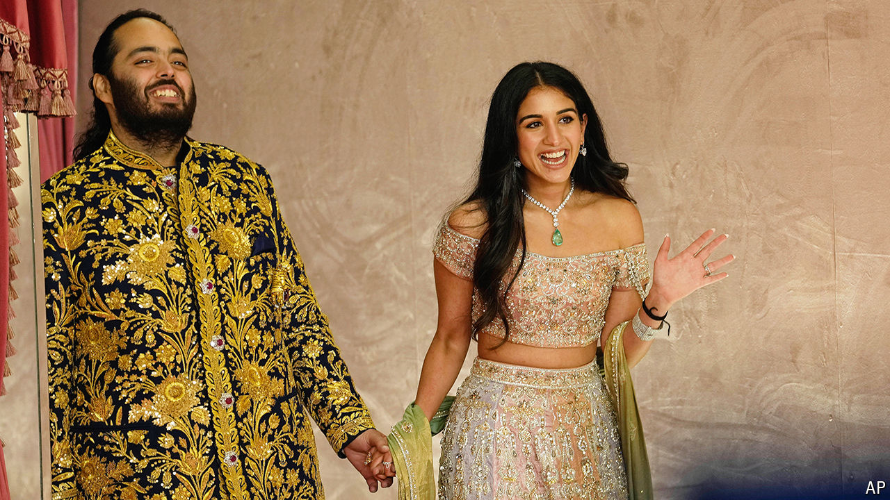

###### Married, with chiding

# What a $600m wedding says about India’s attitude to wealth 

##### The Ambani nuptials enticed everyone from Justin Bieber and Shah Rukh Khan to John Kerry 

 

> Jul 16th 2024 

WHEN BEYONCÉ performed at a pre-wedding party for Isha Ambani in 2018, India was agog. Merely receiving an invitation conferred bragging rights on status-obsessed business leaders and politicians. The cost of the nuptials, with countless ancillary events, was said to be in excess of $100m. That is a staggering sum for almost anyone—but not the Ambani family, which owns a controlling interest in , the country’s most valuable company, dominating everything from telecoms to oil refining. Despite some anti-rich finger-wagging, many Indians appear to have viewed the event, which even the maharajas of yore would envy, as evidence that India—and Indian business—could once again glitter.

