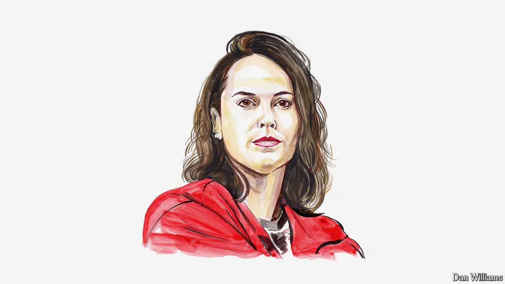

###### Breaking good

# Rachael “Raygun” Gunn on the new sport that will invigorate the Olympics 

##### The Australian breaker hopes we’ll all soon be talking about B-Girls, B-Boys and double airflares 

 

> Jul 16th 2024 

BREAKING (WHICH you may know as breakdancing) will make its Olympic debut—the only sport to do so—at this summer’s Paris games. It joins new urban sports BMX, skateboarding and 3v3 basketball, which debuted at Tokyo 2020, and is part of a broader shift by the International Olympic Committee to include more youth-oriented events. Yet breaking is judged in a completely different way—a way that ensures audiences will see something entirely new at these Olympics.

