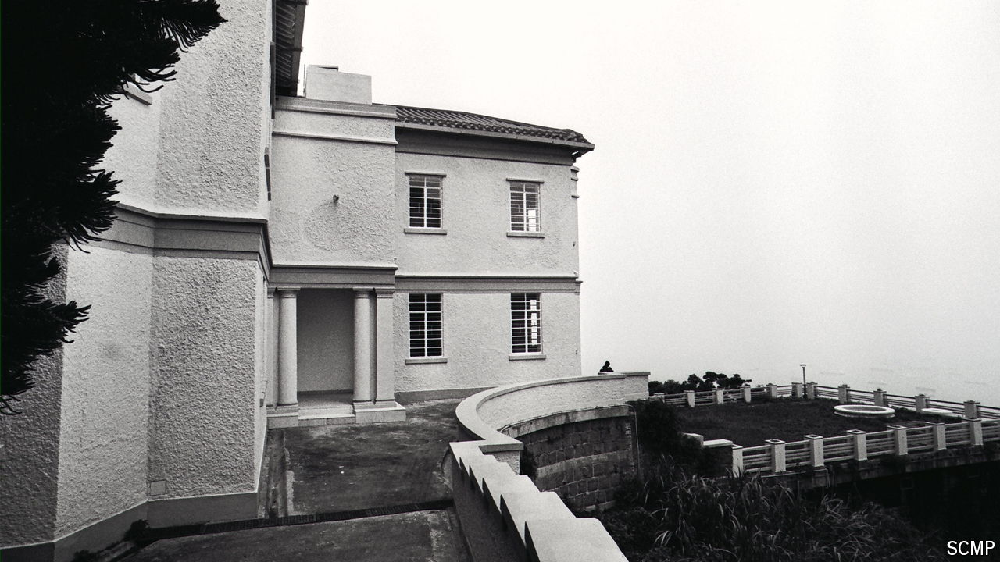

###### Chasing ghosts

# A spectre looms over Hong Kong’s property market 

##### Why mortgage payments in the city can be ghoulishly expensive 

 

> Jul 18th 2024 

Properties on the Peak, a rich neighbourhood in Hong Kong, are among the world’s most desirable. But nobody lives in Dragon Lodge, an Italianate mansion built in the 1920s. It was abandoned shortly after it sold, for HK$118m ($15m), in 1997. Rumour has it that nuns were beheaded there during the Japanese occupation in the second world war; they haunt the shadowy halls. 

