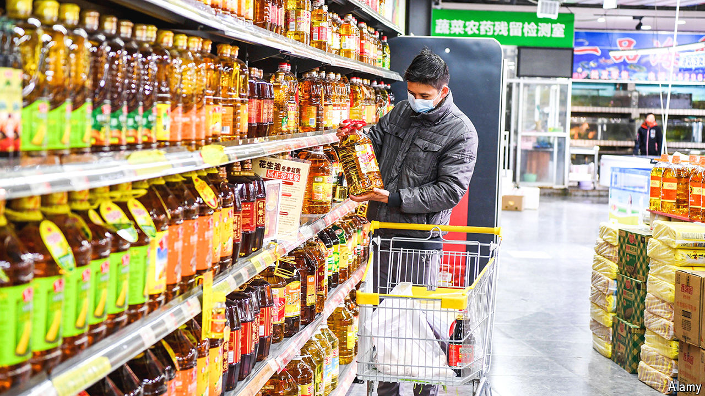

###### Fuelling outrage

# Fury erupts in China over a food-safety scandal 

##### Rare investigative journalism touches a raw public nerve 

 

> Jul 18th 2024 

Investigative journalism is a rarity in China. The Communist Party prefers stories that puff up its achievements. So readers paid particularly close attention when a newspaper run by the Chinese capital’s own party committee, , deviated from the norm. On July 2nd it reported that cooking oil was being transported by lorry in containers that were also being used to carry liquid fuel. It said that, to save money, the vessels were being switched from one use to the other without being cleaned. In a country where food safety has long worried the public, this news was sensational. The newspaper even provided video that implicated a giant state-owned firm, Sinograin. 

