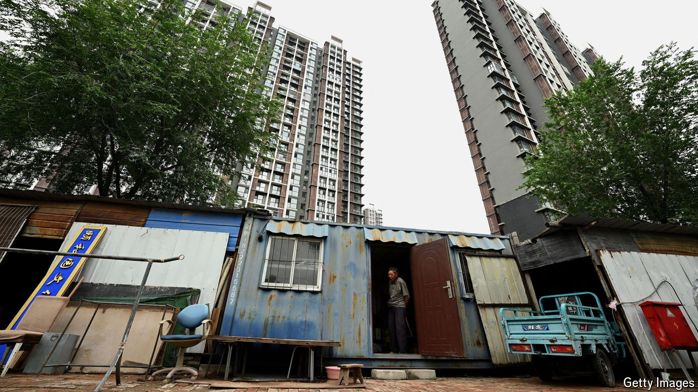

###### Trickle-down economics

# The No.1 reason for success in China? Connections 

##### People are starting to blame inequality on the system, not idleness 

 

> Jul 18th 2024 

China’s ancient thinkers knew about the dangers of inequality. “Rulers need not worry about scarcity, but unevenness,” said the “Analects”, a collection of sayings attributed to Confucius, a philosopher of the 6th and 5th centuries BC. China’s leader, Xi Jinping, uses the language of Mao Zedong, but the message is the same. He calls for “common prosperity”, warning that in the West, wealth gaps have caused dangerous social divisions.

