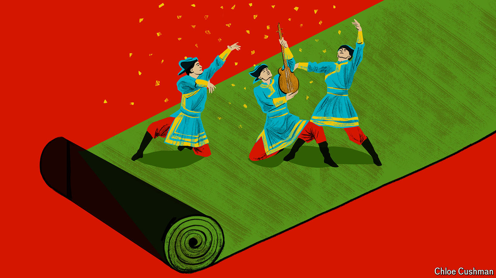

###### Chaguan

# When party propaganda falls flat 

##### To control ethnic Mongolians, Xi Jinping revives a Mao-era tool 

 

> Jul 18th 2024 

China’s Communist Party has an Astroturf problem. For a decade the party has worked to revive grassroots networks that withered during the me-first, get-rich-quick years of the 1990s and 2000s. Under Xi Jinping, China’s leader since 2012, vast resources have been deployed to make the party a growing presence in everyday life. Alongside lessons in Xi Jinping Thought, Maoist campaigns and slogans have been resurrected, tapping into popular nostalgia for a time when China was poor but more equal. 

