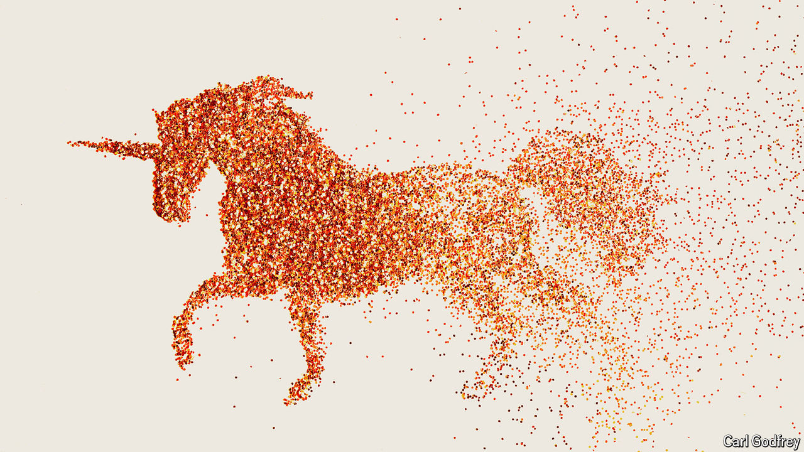

###### The Chinese tech scene

# Xi Jinping is trying to love-bomb China’s entrepreneurs 

##### It will take a lot more to win back their broken hearts 

 

> Jul 16th 2024 

China’s leader, , worries about “black swans” (unexpected crises) and “grey rhinos” (big problems that are ignored). Recently he has been fretting about vanishing unicorns, too. In May he asked a group of bosses to explain why fewer  were turning into these beasts: privately held startups with a valuation of a billion dollars or more. In June the State Council, China’s cabinet, acknowledged that investors were fearful of putting money into risky new ventures and that it was difficult to cash out.

Reviving China’s flagging entrepreneurial spirits has become urgent. As this article was published, the Communist Party’s Central Committee ended a four-day meeting in Beijing. The meeting decided to “place reform in a more prominent position”. During the event new data added to gloom, showing that gdp growth in the second quarter of 2024 slowed to 4.7% year-on-year. Successful startups could boost growth and technological self-sufficiency, which are key party aims. 

