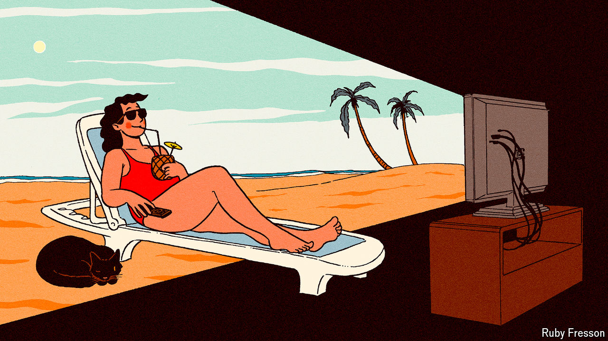

###### Screen time

# The best film and television of 2024 (so far) 

##### What to stream on your summer holiday 

 

> Jul 12th 2024 


A rumpled English archaeologist (Josh O’Connor) slouches his way around Tuscany in the 1980s and helps a rollicking band of grave robbers unearth Etruscan artefacts to sell on the black market. An odd and playful Italian film.

