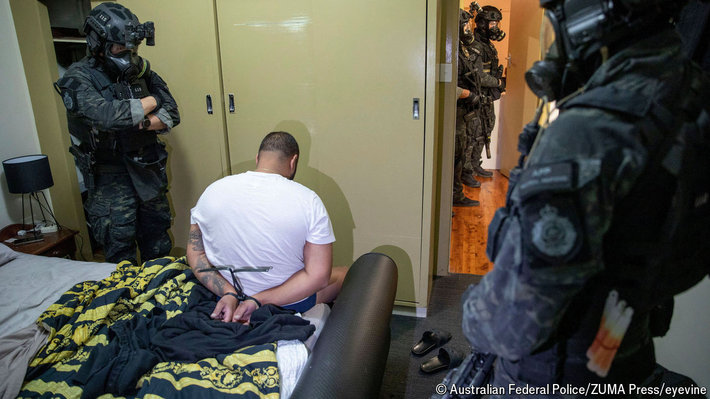

###### The telephone game

# The largest sting operation you’ve never heard of 

##### A new book looks at Anom, a messaging app started by the FBI to catch criminals 

 

> Jul 16th 2024 

By Joseph Cox. 

IN JUNE 1970 the CIA did something audacious. In partnership with the BND, Germany’s spy agency, it secretly bought , a Swiss firm that was then the world’s leading purveyor of cipher machines. The devices were used by over 120 countries to encrypt sensitive diplomatic and military communications. For almost 50 years America, having subtly rigged the machines, could read many of those messages. “It was the intelligence coup of the century,” boasted a CIA report. 

