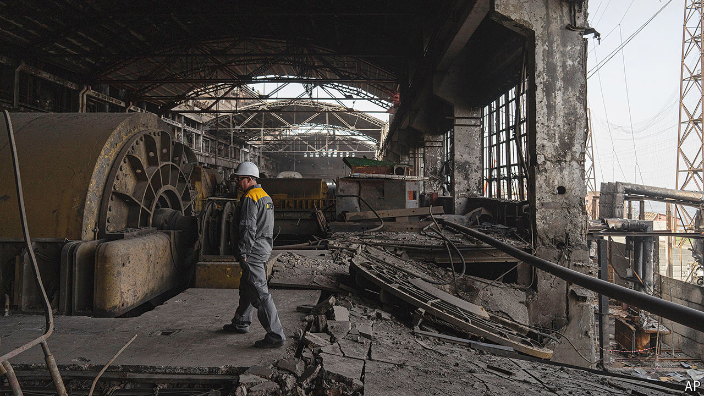

###### Racing against time

# Half Ukraine’s power is knocked out; winter is coming 

##### Ingenuity can get you only so far 

 

> Jul 15th 2024 

On a tour of a destroyed power plant—unidentified for security reasons—the monumental damage wrought by Russia’s spring campaign against Ukraine’s  is clear. The vast Soviet-era coal-fired power station is gutted: walls charred by a fire that that burnt for over 24 hours, windows blown out, roof collapsed, machinery wrecked, pipes and ducts broken; everywhere a mess of rubble, twisted metal support struts, flayed steel cables, wire.

Serhiy (who asked that his surname not be used), a senior engineer, puts his finger in the shrapnel holes in the 20mm-thick hulls of the turbines, to illustrate the force of the blast. Incredibly, there were no casualties among the 15 or so key staff that are required to remain on site during air-raid alerts, hunkered behind sandbags in control rooms in the centre of the plant. Rain falls into pools of light from the holes in the shredded roof. It is unnaturally quiet. 

