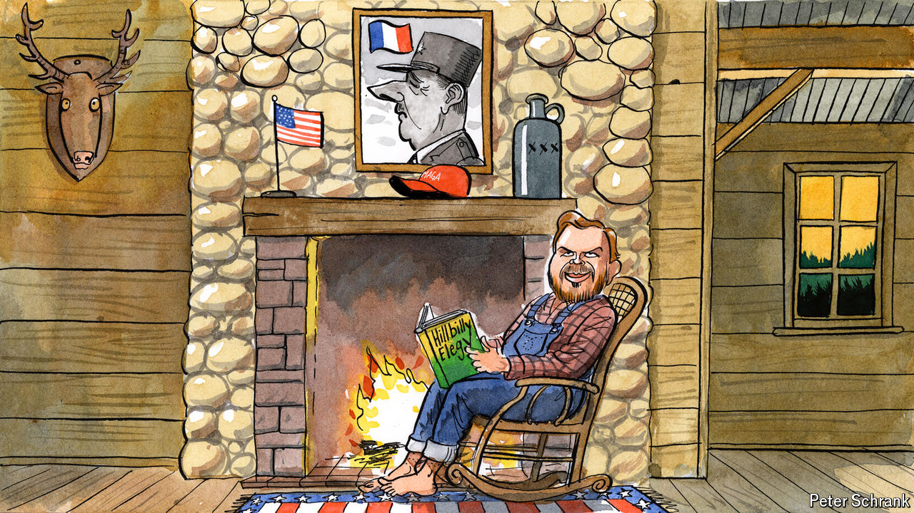

###### Charlemagne

# J.D. Vance, an honorary Frenchman, sends Europe into panic mode 

##### Millennial, MAGA champion, hillbilly…Gaullist 

 

> Jul 18th 2024 

When American senators are asked to name a political idol, they usually reach for a figure carved on Mount Rushmore. J.D. Vance, the newly minted Republican nominee for the vice-presidency, unexpectedly plumped for a Frenchman. Asked by Politico, a news site, earlier this year whom he looked to for inspiration, Mr Vance paused for a moment then cited Charles de Gaulle.  Might this transatlantic admiration be good news for Europe, badly in need of allies in the Trumpian camp it fears will be back in power in Washington come January? Not so much. What Mr Vance admires in the French post-war president was the “invigorated self-confidence” he exuded on behalf of his country, diplomatic talk for telling allies to go stuff themselves when he felt like it (as the general did with NATO when it displeased him, say). Europeans fretting about America’s continued support for Ukraine are unlikely to be reassured.

