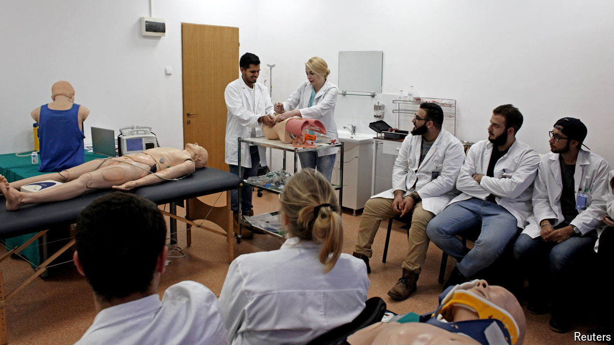

###### Romanian doctor training

# Romania is now a magnet for the world’s medical students 

##### But Romanian doctors are leaving 

 

> Jul 18th 2024 

After struggling to land a place on a medicine course in France, Louise Louvet reluctantly heeded a friend’s advice: give Romania a chance. “I thought there was no way in hell I’d move there,” she says, now a sixth-year medical student at the University of Medicine and Pharmacy in Cluj-Napoca. A visit to the campus had quickly changed her mind. Crowds of international students and the school’s focus on practical care and teaching offered a welcome contrast to the dour rote-learning she had experienced in France. “After that, I said let’s do it.” 

