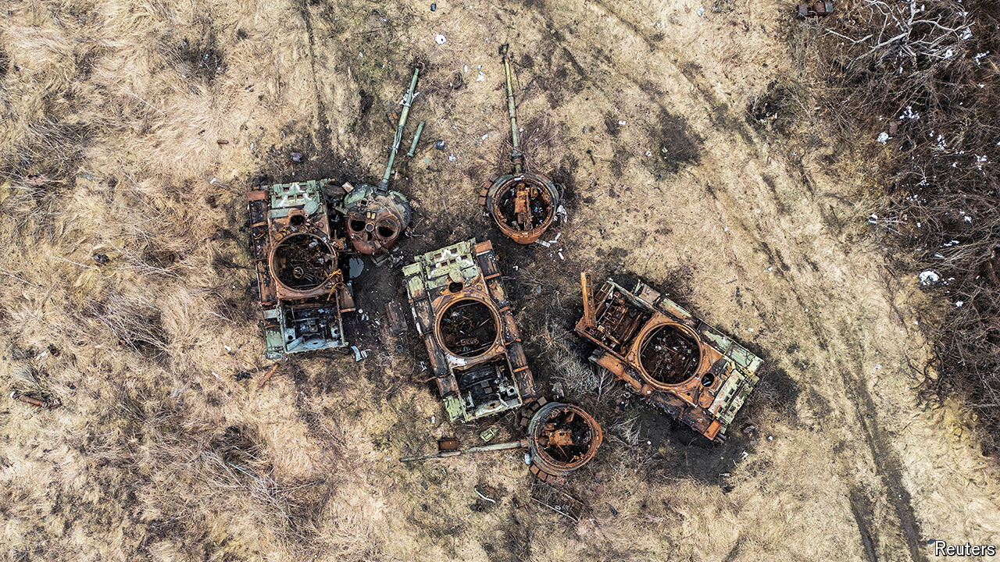

###### While stocks last

# Russia’s vast stocks of Soviet-era weaponry are running out 

##### It may have to scale back its offensive in Ukraine 

 

> Jul 16th 2024 

FOR A LONG time it seemed that a war of attrition between Ukraine and a Russia with five times its population could end only one way. But the much-vaunted Russian  in the north that started in May is fizzling out. Its advances elsewhere along the line, especially in the Donbas region, have been both strategically trivial and achieved only at huge cost. The question now is less whether Ukraine can stay in the fight and more how long can Russia keep up its current tempo of operations.

