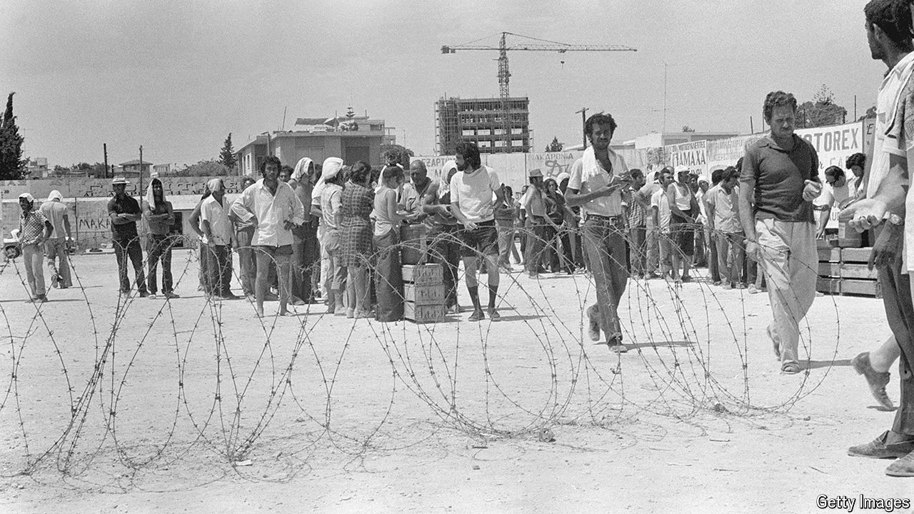

###### Fifty years on

# The division of Cyprus looks indefinite 

##### The island’s Greeks and Turks seem contented, for the moment, to stay apart 

 

> Jul 18th 2024 

AS ONE OF the world’s oldest conflicts turns 50 this week, a resolution to the division of Cyprus remains far away. Unless, that is, you consider the status quo to be a resolution of sorts.

The island of Cyprus won independence from Britain in 1960 and was almost immediately riven by disputes between its largely Greek south and its largely Turkish north. After violence broke out in Nicosia, the capital, in 1963, the UN sent in peacekeepers. In 1974 the junta that ruled Greece tried to unite Cyprus with Greece, ousting the president of the island. That led Turkey to invade on July 20th, eventually taking control of just over a third of the island. In time, the Turkish part, divided from the Greek bit by a UN-administered buffer zone, became the Turkish Republic of Northern Cyprus (TRNC), recognised by Turkey but nobody else.

