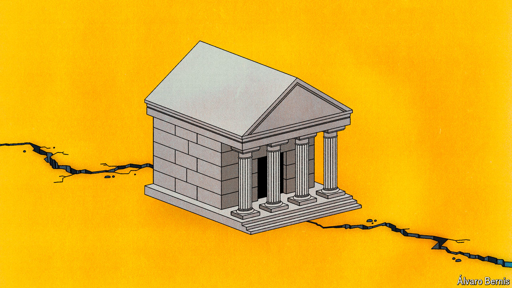

###### Free exchange

# Americans are wrong to wish for an era of stable bipartisanship 

##### Even though political instability is an economic threat 

 

> Jul 18th 2024 

America’s stability can no longer be taken for granted. That is one possible conclusion from the near assassination of Donald Trump, reinforcing lessons already learned from the attack on the Capitol in January 2021. Regrettably, America is not exceptional in this regard. The past few months alone have featured a shooting of Slovakia’s prime minister, an assault on Denmark’s prime minister and attacks on politicians in Germany.

