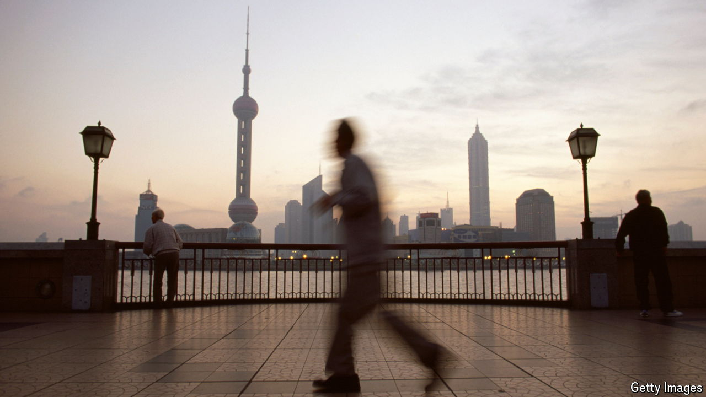

###### Sour spot

# China’s leaders face miserable economic-growth figures 

##### Reality intruded at the “third plenum”, intended to discuss long-term reforms 

 

> Jul 15th 2024 

The Jingxi Hotel in Beijing is known for its home-made yogurt—and for hosting some of the most important meetings in the history of the Chinese Communist Party. These gatherings include the “third plenum” of 1978, which confirmed Deng Xiaoping’s rise to power and the opening of China’s economy. From July 15th-18th, the country’s leaders met for  in this closely guarded venue. With luck, they savoured their yogurt. Because outside the hotel walls, the economy was again turning sour.

Figures released on the opening day of the meeting showed that the economy grew by 4.7% in the second quarter, compared with a year earlier. The number was both weaker than expected and slower than the previous quarter’s figure, when growth seemed to be stabilising. It puts the government’s official growth target for this year—around 5%—in doubt.

