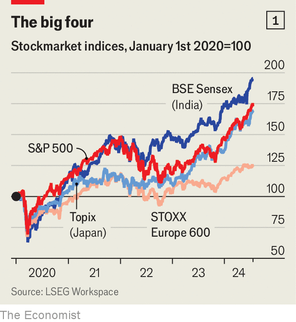

###### Matadors gather

# Stocks are on an astonishing run. Yet threats lurk 

##### We assess what could bring the bull market to an end 

 

> Jul 16th 2024 

All around the world,  have been rising at a breakneck pace. Whether you are in America, Europe, Japan or India, prices listed on a bourse near you have spent most of this year setting fresh records, only to break them again straight away (see chart 1). America’s S&amp;P 500 index has jumped by over 70% since a trough in 2022, and risen during 28 of the past 37 weeks, its best streak in more than three decades. True,  are in a funk, with stocks yet to recover from a plunge that began last year. But they cut lonely figures: exclude China from MSCI’s index of emerging-market shares, and the remainder have been clocking rapid gains, too. 

 


