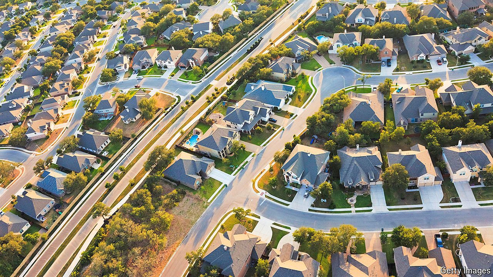

###### Yes, please

# YIMBY cities show how to build homes and contain rents 

##### But to take full advantage of deregulation, Austin and Auckland need other changes 

 

> Jul 17th 2024 

Houses in Bouldin Creek, a neighbourhood in Austin, Texas, are cavernous, but occupy only a fraction of their plots. Rules known as the “McMansion ordinance”, intended to preserve the area’s character, ensure there is space between them. Architects must squeeze the design of a  into an imaginary tent rising five metres from the plot’s edge, then angling in at 45 degrees. The rules seek to prevent sprawling developments from replacing small houses. Instead, the cost of complying with them has ensured that only large, expensive homes are viable. 

Things are now starting to change. Alongside Auckland in New Zealand, Austin has become a test case for housing deregulation. For YIMBYs, activists who say “yes in my backyard” to development, reforms in the cities are shining examples to be followed elsewhere. There are signs such campaigners are winning the debate in the anglosphere.  has made “getting Britain building again” a central aim; a push for affordable housing is core to the appeal of Canada’s opposition Conservative party. As case studies for the effectiveness of YIMBY reforms, both Austin and Auckland show signs of success. Yet they also show that changes are slow to take effect and may, on their own, have a modest impact. 

