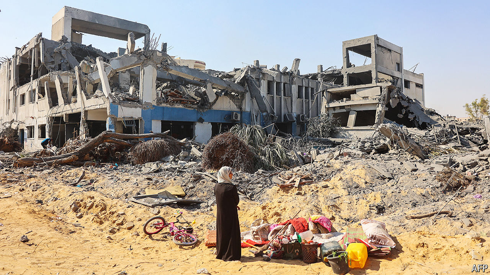

###### The Geneva Conventions at 75

# Could America fight its enemies without breaking the law? 

##### The speed and intensity of prospective conflicts could test the laws of war 

 

> Jul 18th 2024 

GLOOM WILL accompany the 75th anniversary of the Geneva Conventions next month. Debates rage as to whether this batch of treaties, which govern how wars may be fought, and later protocols, which ban genocide, torture and more, remain fit for purpose. The head of the International Committee of the Red Cross (ICRC) has warned of “increasing elasticity” in how countries apply the laws of war, which the conventions underpin. 

