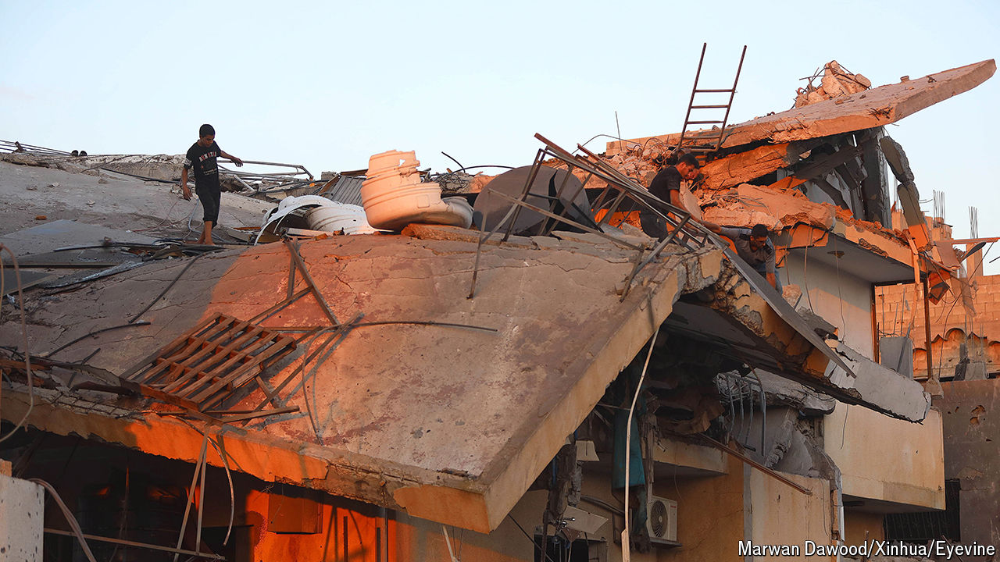

###### The Middle East

# Gaza could become “Mogadishu on the Med” 

##### Even if there is a ceasefire, its prospects are grim 

 

> Jul 18th 2024 

The war in Gaza is in a new phase. The fighting is tapering down, although Israel is still conducting air strikes against Hamas. One of these on July 13th may have killed the military mastermind behind the October 7th attacks, Muhammad Deif, as well as scores of fighters and civilians.  continue in Qatar and Cairo, with signs that Hamas is prepared to agree to a temporary truce and a swap of hostages and prisoners, without first demanding a permanent .

, Israel’s prime minister, is clinging to power. On July 24th he is due to address Congress in Washington, where he is likely to dwell on the threat posed by Iran and its proxies to Israel and the region—and evade the question of what happens next in Gaza. America should call him out. As our forthcoming podcast from the exclave explains, it could become a failed statelet, a “Mogadishu on the Med”. This is an awful prospect for Gazans. It would also make Israel less safe.

