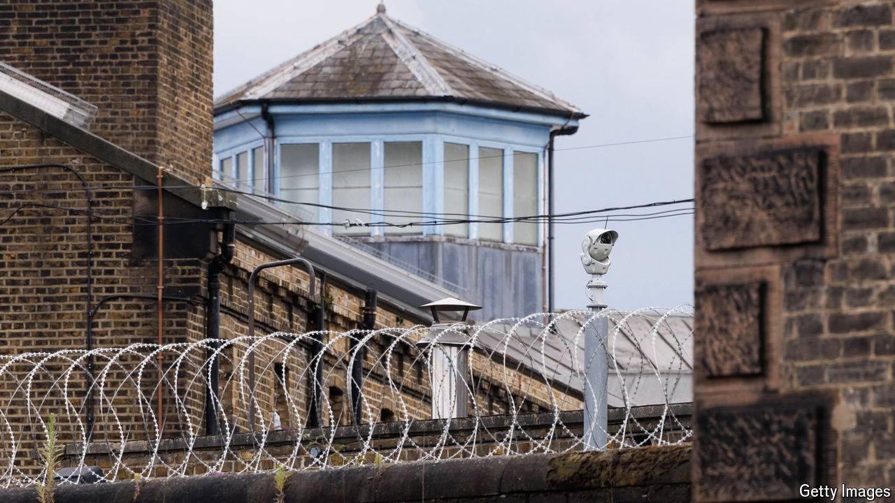

###### Chokka chokey

# How Labour should reform Britain’s overstuffed prisons 

##### With no room for new prisoners, something has to change 

 

> Jul 18th 2024 

BRITISH PRISONS are bursting. The new Labour government has been told that space is so scarce that prisons could start turning away new inmates within weeks; to free up cells,  after serving 40% of their sentence, rather than 50% as normal. Some of the blame for this crunch lies with the previous government: the Tories ducked taking more emergency measures to alleviate overcrowding. But the trouble in Britain’s prisons dates back decades, bears the fingerprints of both main parties and reflects the fraught politics of law and order. 

