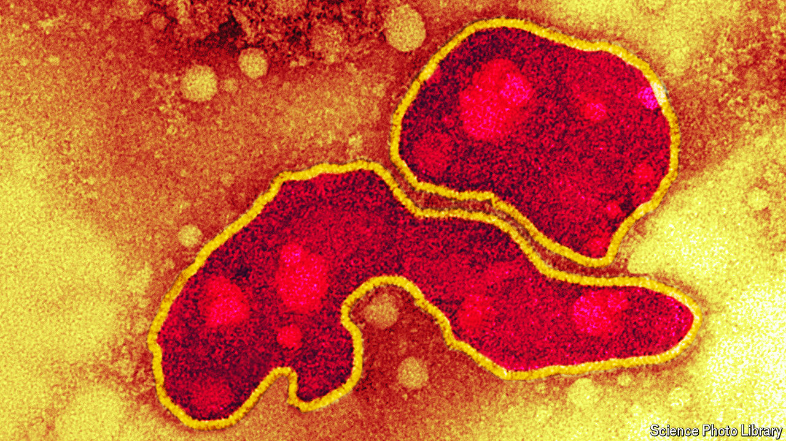

###### Avian influenza

# Millions of birds have died. How to stop humans dying, too 

##### As isolated human cases of H5N1 emerge, now is the time to prepare 

 

> Jul 17th 2024 

Over the past couple of years the largest outbreak of  (h5n1) in recorded history has torn across the planet. The virus, which is deadly to birds, has devastated wild and domesticated flocks alike. Attempts to stop transmission have seen hundreds of millions of birds culled on farms since the strain was first identified in 1996. Wild bird deaths are probably in their millions at least. The danger is that, as the virus mutates, a  becomes a human one. Precisely how h5n1 will adapt and spread is impossible to predict. But the time to prepare is now. 

