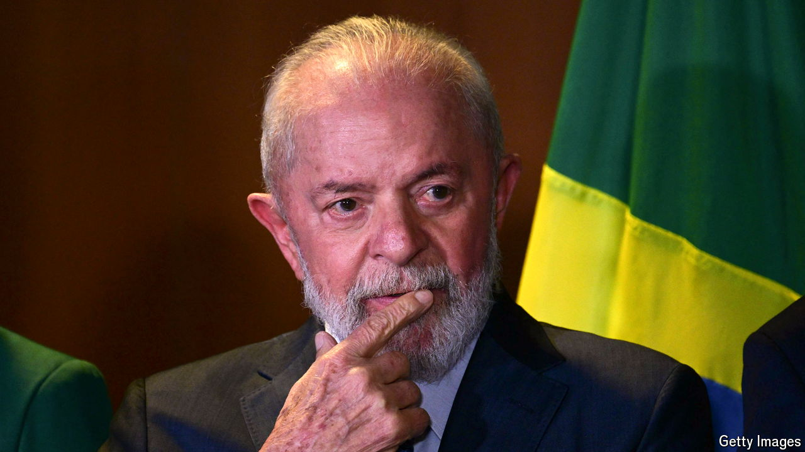

###### A profligate president

# To halt Brazil’s decline, Lula needs to cut runaway public spending 

##### Investors have started to worry 

 

> Jul 18th 2024 

When in 2022 Luiz Inácio Lula da Silva narrowly defeated Jair Bolsonaro in Brazil’s presidential election, democrats everywhere were relieved. Mr Bolsonaro, a hard-right populist, had spread intolerance and guns, and encouraged the despoliation of the Amazon rainforest. His threat to democracy was summed up by his failed attempt to persuade the armed forces to overturn his election defeat. Whatever his faults, Lula is a democrat. And he has moved quickly to curb deforestation, which is in both Brazil’s and the world’s interest.

But in other respects Lula’s third stint as president has . In the first, from 2003 to 2007, he stabilised the economy with  and pushed through economic reforms and social programmes that boosted growth, cut poverty and secured him re-election. Aided by a commodity boom, his second term saw a public-spending splurge. Some of the money went on corruptly padded contracts. The boom ended, but the splurge continued under his chosen successor, Dilma Rousseff, who added wasteful and ineffective industrial policies. That eventually tipped Brazil into its deepest recession since 1930, while activist judges sent scores of politicians, including Lula himself, to jail for corruption.

