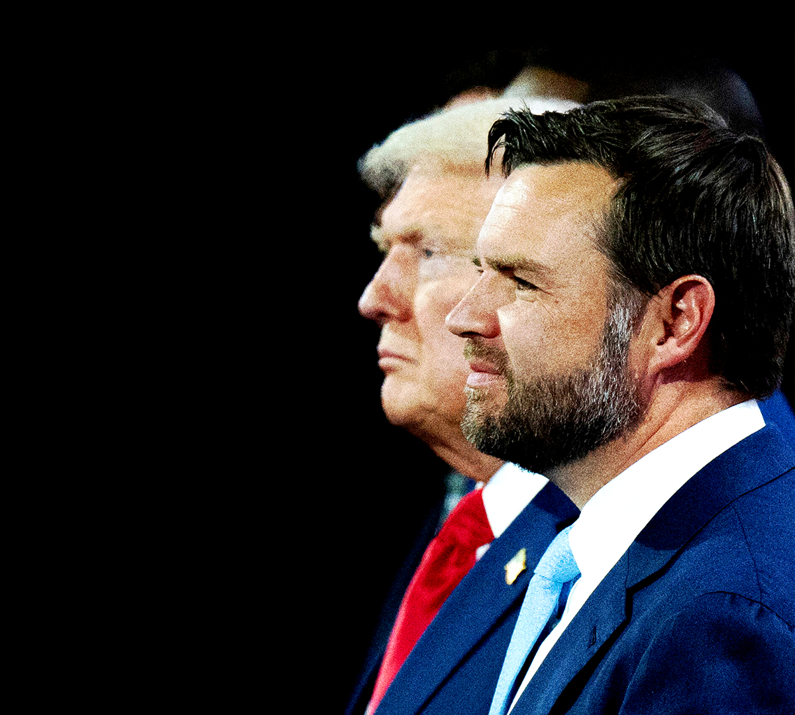

###### America’s presidential election

# Where would Donald Trump and J.D. Vance take America? 

##### The anti-globalist MAGA enthusiast is more consequential than the average veep pick 

 

> Jul 18th 2024 

America has passed through one of Lenin’s weeks in which decades happen. Had Thomas Matthew Crooks fired an inch to the right, had Donald Trump not turned his head, he would now be dead. Fortunately, Mr Trump was not seriously hurt. And fortune blessed him in other ways, too. In Florida a judge dismissed the strongest case against him, and his enfeebled opponent, Joe Biden, , though more Democrats are urging him to drop out. At the Republican convention in Milwaukee this week Mr Trump’s presence was greeted as a sign of divine providence. Delegates sported baseball caps with “45/47” on them. That used to be an aspiration; today it looks like a prediction.

One of the best arguments Democrats can use against Mr Trump is that he threatens democratic norms. Yet his courage in the moment of the shooting made him seem, however briefly, more like a defender of American values than a threat to them. His calls for unity afterwards buttressed his claim to be a strong leader in a dangerous world. Yes, any effect on the polls may be temporary. America is so partisan that the nominees have a reinforced-concrete ceiling. The , too. However, some effects of the shooting and its aftermath may last.

