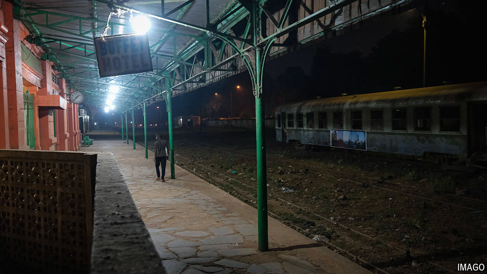

###### A railway boom

# Africa’s surprising new age of rail 

##### Sino-American tensions are playing out on the tracks 

 

> Jul 18th 2024 

“Every inhabitant of Thiès”, wrote a Senegalese novelist, Ousmane Sembène, in 1960, “depended on the railway.” Like many African cities, Thiès was a product of the continent’s first, colonial-era rail revolution. The French-built railway that ran through it stretched from the Senegalese port of Dakar to Mali, deep in the Sahel, ferrying peanuts, gold and other raw materials to the coast for export. But in recent decades the line has atrophied. A succession of foreign firms took over its management after it was privatised in 2003. Each failed to maintain or expand it. In 2018 the leg from Senegal to Mali halted operations entirely. Its rusting remains in Thiès lie under rubbish and weeds. 

The story of west Africa’s most famous railway is a cautionary one for governments across the continent. Africa’s entire rail network is today only slightly larger than France’s and Germany’s combined. In west Africa only one cross-border line is still working. By one estimate, investments of up to $105bn a year until 2050 are needed if Africa’s network density is to match China’s or India’s. Yet between 2012 and 2022 total private investment in rail infrastructure was no more than $6bn, according to the World Bank. That was roughly the same as in the previous decade, despite a surge in infrastructure investment from China. Where Western firms have occasionally shown interest, grand promises have usually remained on paper. 

