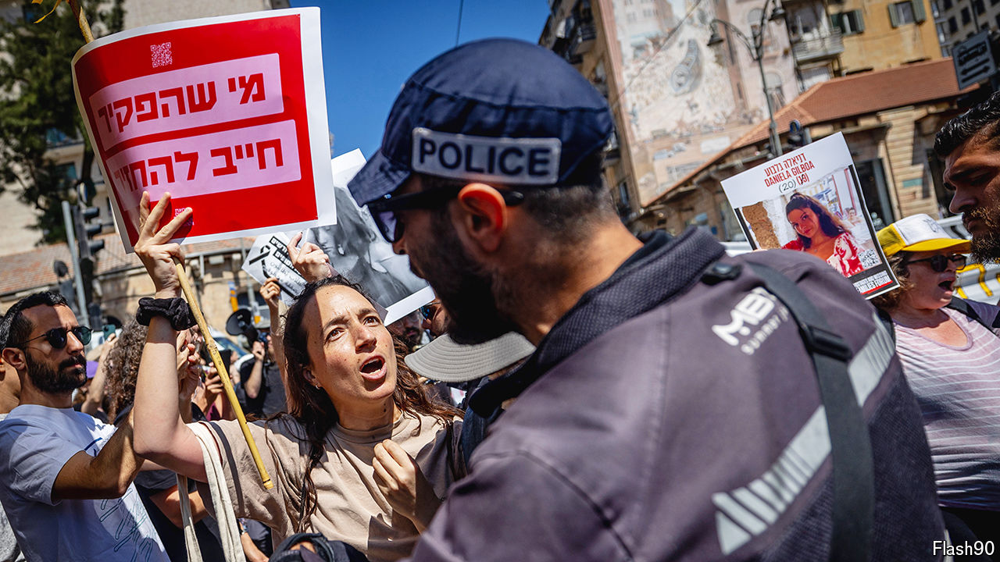

###### Creeping authoritarianism

# The far-right has captured Israel’s police 

##### Binyamin Netanyahu’s coalition partner is eroding the force’s independence 

 

> Jul 18th 2024 

ISRAEL HAS long stood out as a raucous democracy in a region with precious little of it. But on a recent Saturday in Tel Aviv police officers demanded to see the placards of protesters calling for a ceasefire in Gaza and for early elections. The police justified this breach of freedom of expression by claiming it was to ensure there was no “incitement”. In fact, it was a sign of how the police have been politicised in the 18 months they have been under the control of Itamar Ben-Gvir. 

Mr Ben-Gvir, who leads Jewish Power, a far-right and openly anti-Arab party, was once on the distant margins of Israeli politics and seen as such a threat to national security that the Israel Defence Forces (IDF) refused to recruit him. Now, as national-security minister, he is central to the coalition keeping Binyamin Netanyahu in office as prime minister. 

