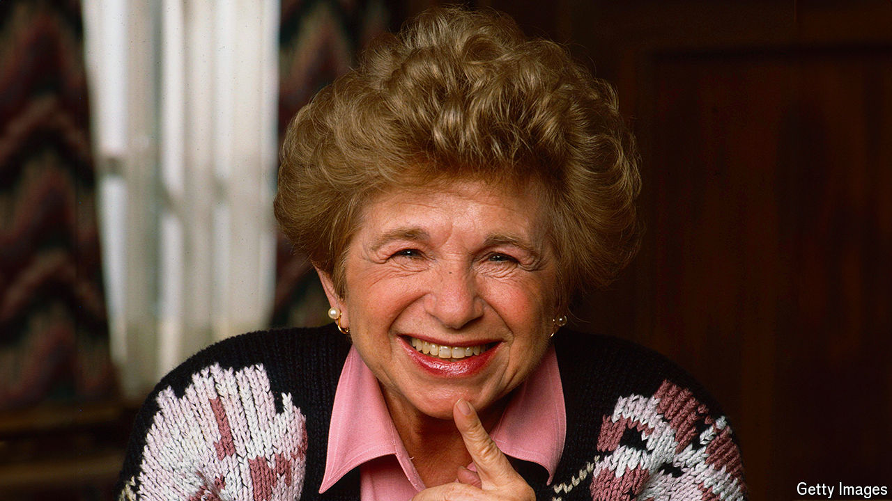

###### Let’s talk about sex

# Dr Ruth aimed to shake America out of its puritan ways 

##### The psycho-sexual therapist and media star died on July 12th, aged 96 

 

> Jul 17th 2024 

Not many people like to boast how short they are, but Ruth Westheimer did. She was all of four foot seven or, in rough metric, a metre and a half. To reach the shelf of the cabinet in her parents’ bedroom where they kept a book all about sex, with a juicy chapter called “The Ideal Marriage”, she had to climb on a chair. When she went to lectures in psychology at the Sorbonne as a young woman, she had to find a strong, handsome guy who could pop her up on a window sill to see the teacher. Her third husband, Fred, first appealed to her because he was short too, as well as good at skiing. On late-night talk shows, when she took a chair beside the host to lay a confiding hand on his arm and chat about genitalia, her little feet swung inches above the ground. 

There were plenty such shows. Throughout the 1980s and 1990s her fame mushroomed, until she became a psycho-sexual therapist to the nation. Wise words poured out of her, and many became books, 45 at the last count. She had one mission: to promote sexual literacy, so that Americans could talk freely and frankly about penises and vaginas, what felt good and where, and what they wanted more of. No more blushes and wrigglings or the silly idea that it wasn’t quite right to discuss these things. Americans should talk about sex as they talked about food. And she was the ideal teacher. She was motherly, latterly grandmotherly, German-Jewish-American with an accent to match, and could dish out advice on foreplay as readily as chicken soup. 

