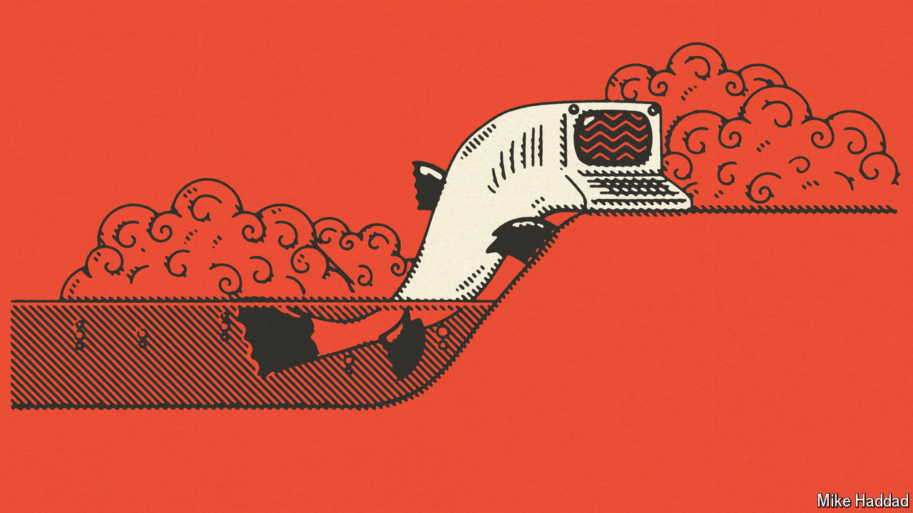

###### Artificial intelligence

# A short history of AI 

##### In the first of six weekly briefs, we ask how AI overcame decades of underdelivering 

 

> Jul 16th 2024 

Over the summer of 1956 a small but illustrious group gathered at Dartmouth College in New Hampshire; it included Claude Shannon, the begetter of information theory, and Herb Simon, the only person ever to win both the Nobel Memorial Prize in Economic Sciences awarded by the Royal Swedish Academy of Sciences and the Turing Award awarded by the Association for Computing Machinery. They had been called together by a young researcher, John McCarthy, who wanted to discuss “how to make machines use language, form abstractions and concepts” and “solve kinds of problems now reserved for humans”. It was the first academic gathering devoted to what McCarthy dubbed “artificial intelligence”. And it set a template for the field’s next 60-odd years in coming up with no advances on a par with its ambitions. 

The Dartmouth meeting did not mark the beginning of scientific inquiry into machines which could think like people. Alan Turing, for whom the Turing prize is named, wondered about it; so did John von Neumann, an inspiration to McCarthy. By 1956 there were already a number of approaches to the issue; historians think one of the reasons McCarthy coined the term artificial intelligence, later AI, for his project was that it was broad enough to encompass them all, keeping open the question of which might be best. Some researchers favoured systems based on combining facts about the world with axioms like those of geometry and symbolic logic so as to infer appropriate responses; others preferred building systems in which the probability of one thing depended on the constantly updated probabilities of many others. 

