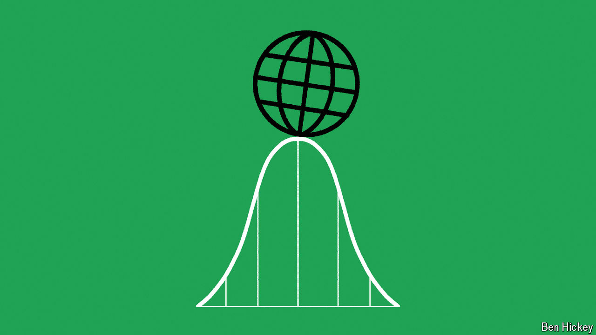

###### Critical moment

# AI can predict tipping points before they happen 

##### Potential applications span from economics to epidemiology 

 

> Jul 17th 2024 

ANYONE CAN spot a tipping point after it’s been crossed. Also known as critical transitions, such mathematical cliff-edges influence everything from the behaviour of financial markets and the spread of disease to the extinction of species. The financial crisis of 2007-09 is often described as one. So is the moment that covid-19 went global. The real trick, therefore, is to spot them before they happen. But that is fiendishly difficult.

