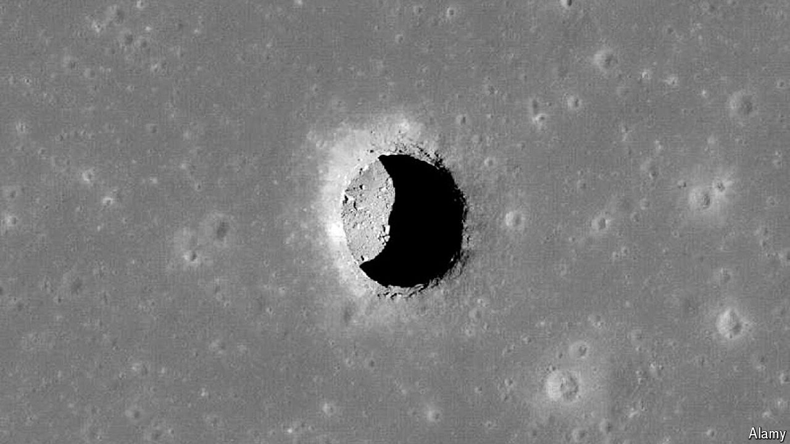

###### Pieds-à-lune

# Astronomers have found a cave on the moon 

##### Such structures could serve as habitats for future astronauts 

 

> Jul 17th 2024 

FROM AN ESTATE agent’s perspective, the lunar surface has little to recommend it. Its none-too-metaphorical lack of atmosphere means it is bombarded by meteorites, cosmic radiation is unrelentingly harsh and temperatures range from lows of -246°C to highs of 121°C. Subsurface lunar caves, on the other hand, with stable temperatures and cover from projectiles, would be much more enticing habitats. The only question is, do any exist?

