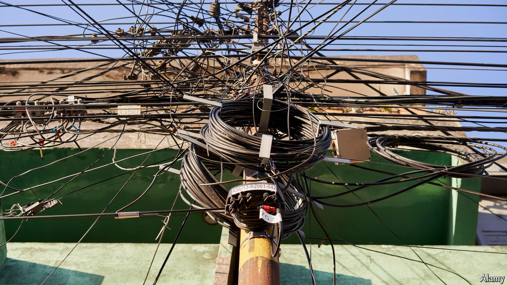

###### Bitcoin mining

# Crypto cowboys have found paradise in Paraguay 

##### Cheap electricity, lax laws and low taxes: what’s not to like? 

 

> Jul 18th 2024 

The country is used to drug busts and bank heists. But the hooded gunmen who recently burst into a warehouse in Minga Guazú, in Paraguay’s rural east, weren’t after cocaine, weed or cash. Instead they sped off with 150 sophisticated computers that had been secretly hooked up to the grid. The shaken caretaker called the police. But when they came, he declined to reveal who owned the clandestine bitcoin-mining operation.

