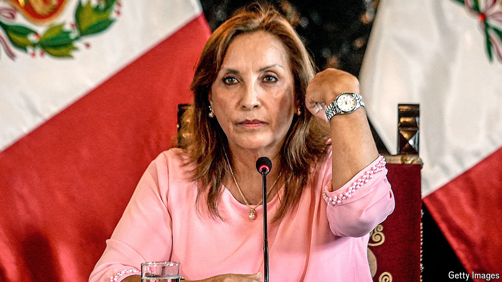

###### An overmighty Congress

# Peru’s president survives because she’s not in charge 

##### The lawmakers are dismantling institutions 

 

> Jul 18th 2024 

In recent times Peru has become accustomed to impeachment attempts, threats to dissolve Congress and accusations of coup-mongering in relentless battles between the president and the legislature. Yet the past year has seen an eerie peace between Dina Boluarte, the president since December 2022, and Congress. That is because both are deeply unpopular. Pollsters give Ms Boluarte an approval rating of just 5%, the lowest in the Americas. 

She has never been loved. She came to office because she was the vice-president of Pedro Castillo, a leftist impeached and arrested because he declared a coup against Congress and the courts. Her first weeks were marked by sometimes violent protests in which security forces killed around 50 demonstrators. The economy has languished on her watch, while crime and poverty have risen. Formerly a low-paid bureaucrat, she has struggled to explain her penchant for Rolex watches. 

