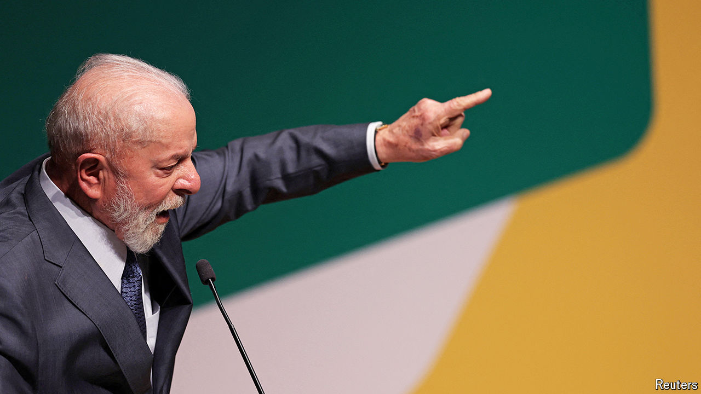

###### The Brazilian economy

# Under Lula, Brazil is walking on the financial wild side 

##### Investors have started to worry about deficits and debt 

 

> Jul 18th 2024 

In the year to mid-June Brazil’s currency, the real, fell against the dollar by 17%, the worst performance of any major currency over this period. The São Paulo stockmarket lost 8% of its value even as other emerging markets rallied. The reasons for this slump are not hard to divine: investors doubt the commitment of Luiz Inácio Lula da Silva, the left-wing president, to responsible fiscal and monetary policies, and mistrust his renewed flirtation with a big state. Their worries now seem to have been heeded, at least partly. This month both Lula and his politically influential wife, Rosângela “Janja” da Silva, went out of their way to back Fernando Haddad, the finance minister, and his efforts to cut the fiscal deficit. Markets have responded: the real has gained about 5% from its low at the start of the month and the stockmarket has risen too.

But the signals are mixed. Lula’s government is spending lavishly and he often seems reluctant to rein that in. He has been meddling in state-controlled companies. He has frequently sniped at Roberto Campos Neto, the president of the central bank, which has been formally independent since 2021. Mr Campos Neto’s term ends this year, along with that of two of the bank’s eight other board members. The government will be able to replace them, if the Senate approves. That means that six of the nine members of the board will have been appointed by Lula. 

