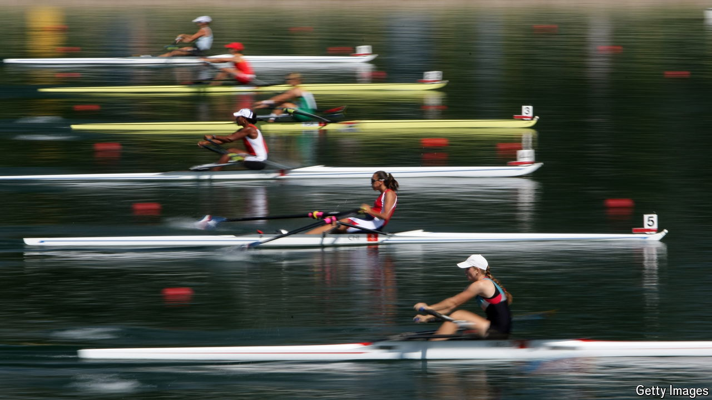

###### The Economist reads

# Five books on the glories and flaws of the Olympics 

##### The games fall short of their ideals, but they’re still worth watching 

 

> Jul 11th 2024 

DOES ANY endeavour express the virtues and faults of the human race quite so well as the Olympic and Paralympic games? The sports extravaganza, which has summer and winter versions, is supposed to exemplify ideals of fellowship as well as excellence (hence the motto “faster, higher, stronger–together”). And it does. Inevitably, it has also displayed less admirable traits, such as greed and a propensity to cheat. Togetherness falters when governments behave in ways that the International Olympic Committee (IOC) feels it must punish. At the games that begin in Paris on July 26th, Russian (and Belarusian) athletes will have to compete as neutrals because Vladimir Putin made war on Ukraine. (Russia has been  for state-sponsored doping.) 

The five books we recommend here show both the glories and the failures of the games, from the astonishing feats of marathon runners and dancing horses to the environmental and financial costs and geopolitical controversies. The Olympics have some claim to be the greatest show on Earth, but ever fewer cities are willing to play host to the party. As you watch the spectacle—the first games since the pandemic that will not be trammelled by restrictions to protect public health—these books will deepen your understanding and appreciation of it.

