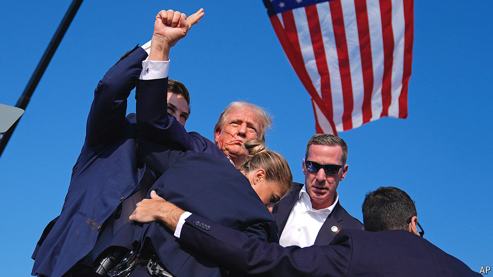

###### The world this week

# Politics 

#####  

 

> Jul 18th 2024 

The FBI began an  into why a 20-year-old man tried to assassinate . Questions were raised about how Thomas Matthew Crooks was able to get so close to Mr Trump at a campaign rally in rural Pennsylvania. His volley of shots from a nearby rooftop came close to killing the Republican, grazing his ear. One man was killed and two seriously injured. Secret Service snipers shot Crooks dead. The motive for the assassination attempt was not immediately clear. Crooks was a gun enthusiast and described as a quiet loner, but with no mental-health issues. Mr Trump left the stage exhorting his supporters to “Fight! Fight! Fight!” 

“A working-class boy”

