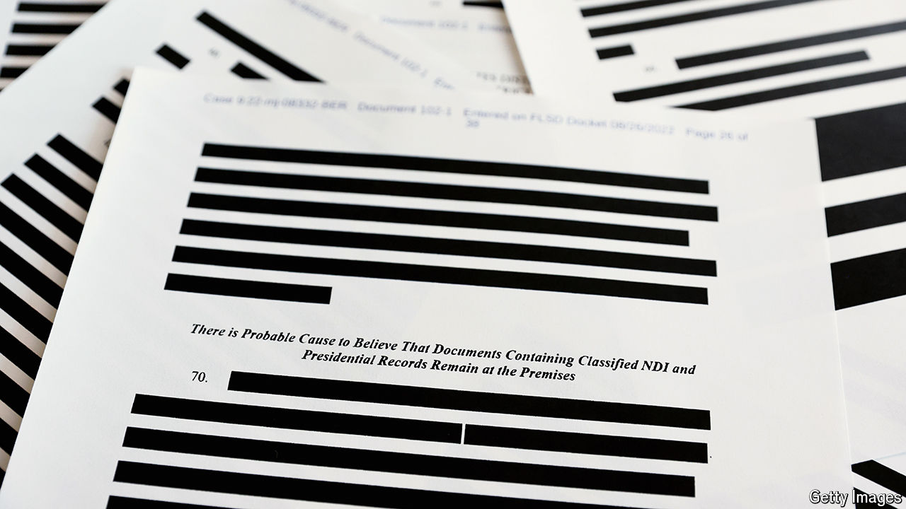

###### Courting chutzpah

# A maverick judge tosses out Donald Trump’s classified-documents case 

##### The ruling may be reversed—but delay helps the former president 

 

> Jul 16th 2024 

A WELCOME piece of news arrived for  on the first day of the Republican National Convention. The criminal case against him for allegedly removing classified documents from the White House (and piling them in, among other places, a ballroom and bathroom at Mar-a-Lago, his Florida home) was thrown out by the presiding judge. Higher courts will probably look askance at the ruling, but it means that Mr Trump’s tactics have pushed his trial past the November election—if it ever begins at all.

Judge Aileen Cannon, appointed by Mr Trump in 2020, has been stretching out the calendar in the first of two lawsuits styled  since she was randomly assigned to the case in June 2023. This week’s ruling contends that the prosecution was illicit from the start. Jack Smith, the special counsel, was installed in violation of the constitution’s “appointments clause”, which requires “officers of the United States” to be nominated by the president and confirmed by the Senate.

