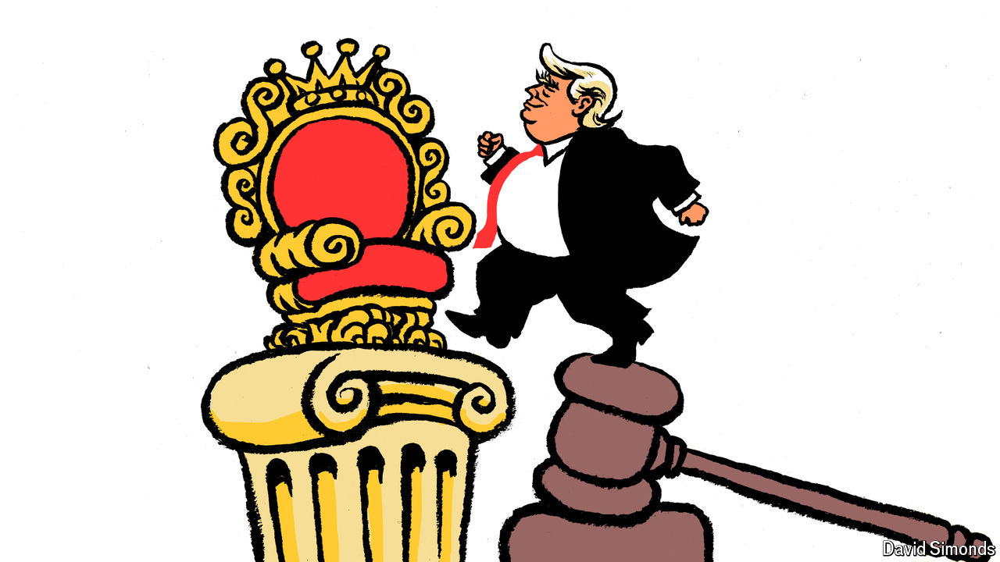

###### Lexington

# Calling Donald Trump a threat to the rule of law has backfired 

##### It strengthened him politically and led to constitutional protections for presidents, not citizens 

 

> Jul 18th 2024 

To President Joe Biden, former President Donald Trump and his “MAGA Republican extremists” are a threat to “the very foundations of our republic”. Democrats once insisted that prosecuting Mr Trump for his conduct as president would illuminate his menace and bar him from the office. For their part, federal prosecutors have never given a hint of partisan objectives; they wanted to vindicate the principle that no one is above the law. 

