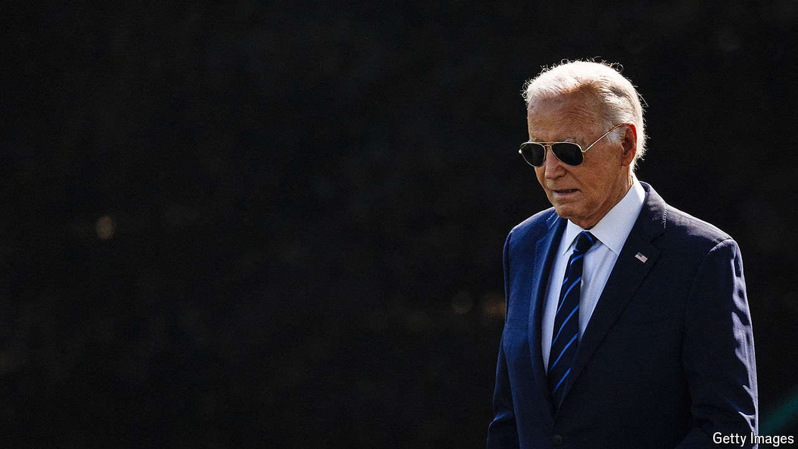

###### Dem dilemmas

# Momentum against Joe Biden is mounting again 

##### After a brief lull, pressure is growing to replace him as the Democratic nominee 

 

> Jul 16th 2024 

WINSTON CHURCHILL’S maxim that “nothing in life is so exhilarating as to be shot at without result” has a political corollary: when a presidential candidate survives an assassination attempt, it can have a rallying effect. Exhilarated Republicans made a display of this in Milwaukee, where the party formally chose Donald Trump as its presidential nominee. 

 on July 13th has also affected Democrats, who have been in turmoil since President Joe Biden’s catastrophic debate performance last month. It disrupted the effort within the party to replace Mr Biden as its nominee. After the shooting, the atmosphere of shock made it untenable for Democratic rebels in Congress to advance their attempt to challenge . For a few days, no new House member or senator publicly called on the president to step aside. 

