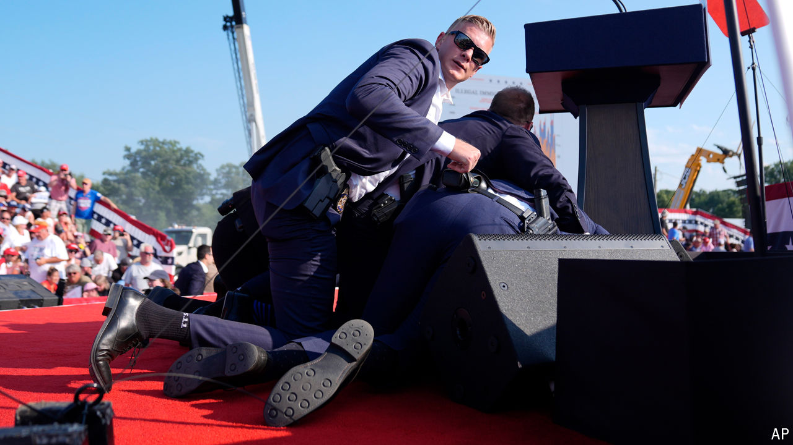

###### Off-target

# The Trump shooting has made a mockery of the Secret Service 

##### Protecting presidents requires communication, not just lots of men with guns 

 

> Jul 17th 2024 

When trying to put in context how close Donald Trump  on July 13th, Anthony Cangelosi, a former  agent, now an academic at the John Jay College of Criminal Justice, uses an analogy that the former president could appreciate. “It’s a chip shot,” he says. For the benefit of non-golfers: one that is easy for somebody who practises. “It’s not hard to hit a target from 150 yards with a rifle,” he says. The shooter, , a 20-year-old from a suburb of Pittsburgh (see box on next page), was a member of a rifle club, though he was apparently rejected from his high-school shooting team. Had he been a slightly better shot, America’s election would now look very different. 

