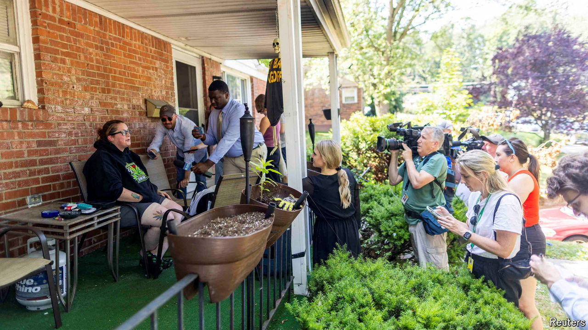

###### Day of the jackals

# What was the motive of Trump’s would-be assassin? 

##### A frenzied media hunt is under way 

 

> Jul 15th 2024 

BY 8.45AM, THE stretch of Milford Drive that was home to Thomas Matthew Crooks, the 20-year-old who , is already host to a traffic jam. Outside the Crookses’ home, dozens of journalists are setting up camp. Five gazebos sit on the carefully manicured grass, providing shade to news anchors, dressed in jackets, ties and comfortable trainers. Not much is happening. The vibe is that of a pride of lions lolling in the midday sun. A Reuters photographer brags about getting the shot of the morning. “Somebody is closing the drapes… you can just see the hand. Think, the hand of God, Maradona,” he jokes.

The entire world’s media are here, in Bethel Park, a suburb of Pittsburgh. There is a writer from , the German magazine; another from the , Canada’s largest newspaper, and one more from the , the global newspaper of Falun Gong, a spiritual movement banned in China. But TV and wire agency men outnumber the newspaper people ten to one. Men heft camera lenses as long as their arms, or sprawl in camp chairs evidently carried at all times for such occasions.

