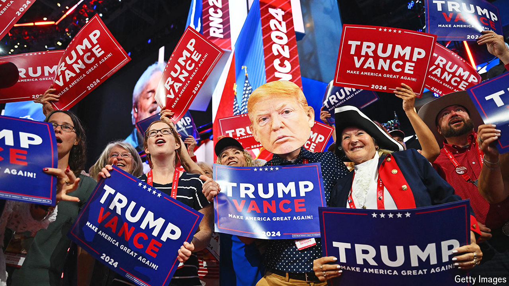

###### The emperor’s reign

# Why MAGA is the future, not just present, of the GOP 

##### The selection of J.D. Vance means that Donald Trump’s influence may linger 

 

> Jul 18th 2024 

WHAT A DIFFERENCE eight years make. When Donald Trump mounted his hostile takeover of the Republican Party in 2016, the mood at the Republicans’ convention that year in Cleveland was poisonous. In 2024, at their convention in Milwaukee, Mr Trump became the first person to secure three consecutive major-party nominations for the presidency since Franklin Roosevelt. Republicanism has become synonymous with Trumpism now.

Eight years ago Ted Cruz, a Republican senator from Texas, gave a convention speech that failed to endorse Mr Trump. This year Mr Cruz opened his remarks with the words “God bless Donald J. Trump” as the former president looked down from his imperial box. Ex-challengers like Nikki Haley, until recently a slashing critic of Mr Trump’s isolationist foreign policy, went supine. The Republican platform has been cast in Mr Trump’s image, right down to his esoteric style of capitalisation. Mr Trump’s daughter-in-law is the new co-chair of the Republican Party. His son was instrumental in the selection of his running-mate, J.D. Vance, a recently elected senator from Ohio. 

