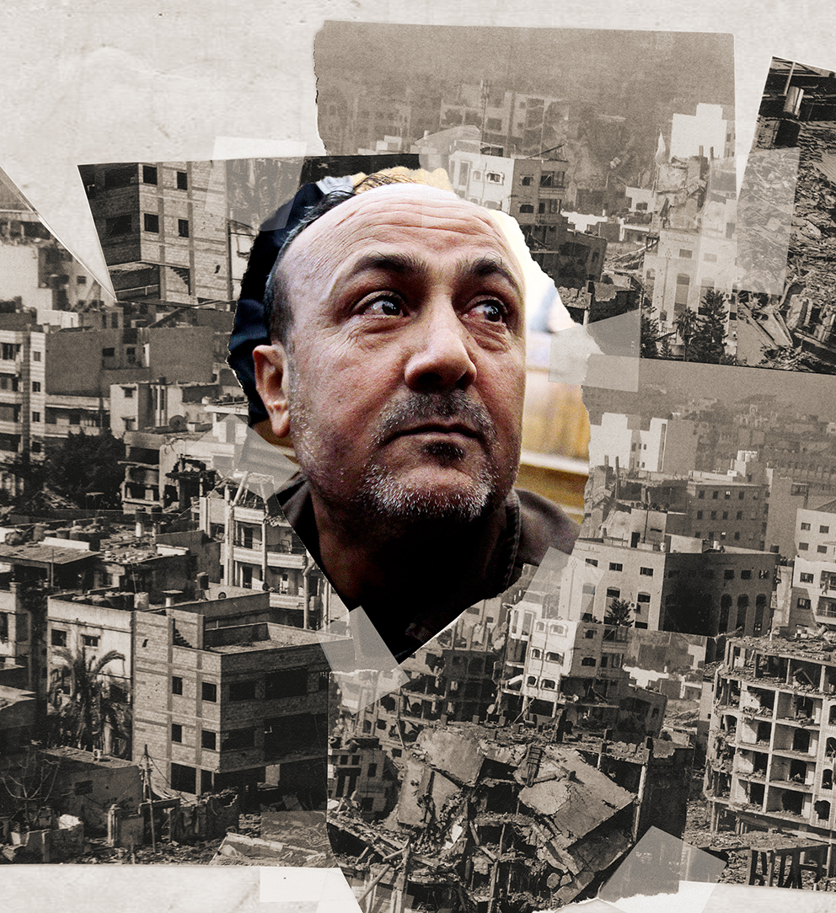

###### Israel/Palestine

# Marwan Barghouti, the world’s most important prisoner 

##### There’s one Palestinian who could help end the conflict. He’s in an Israeli jail 

 

> Jul 22nd 2024 

This spring I took a walk through the farming village of Kobar in the . Its low-rise buildings wound around shrubs and bushes; pale pink blossom was just starting to bloom on the almond trees. On the surrounding hillsides you could see Jewish settlements – neatly ordered rows of identical villas with red tiled roofs. In the months before my visit,  from places like these had been attacking Palestinian villagers, largely with impunity. The buildings of Kobar were covered in graffiti, some of which read “Death to Israel”. 

