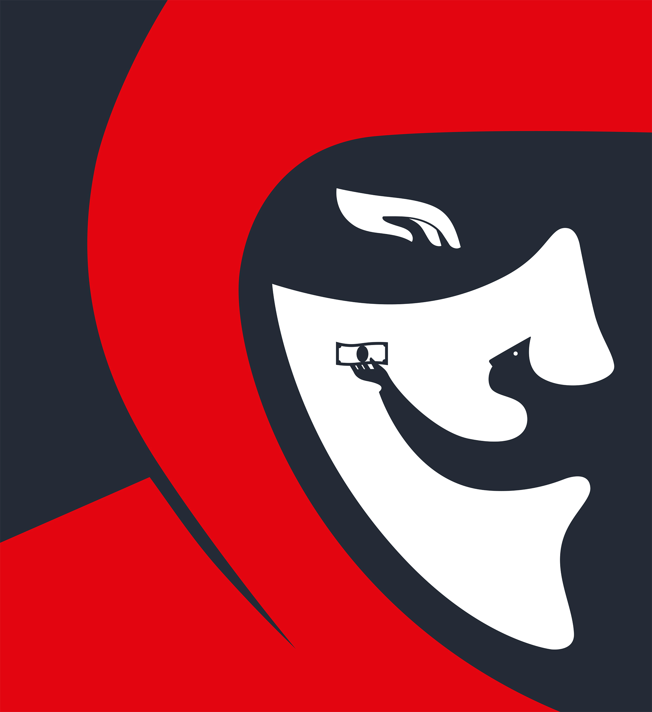

###### Cyber-security

# Secrets of a ransomware negotiator 

##### When the gangs of the dark web come, most people panic. This man runs rings around them 

 

> Jul 24th 2024 

Last autumn, somewhere in Europe, a security operations centre noticed something. This is the primary job of a security operations centre – to notice things. Its role is simple, protecting organisations by tracking the people using their computer networks. Its name is often abbreviated to a simple acronym, SOC (pronounced “sock”.) The people who work at a SOC are the  equivalent of night guards at the mall, sitting at a bank of television screens: watching, waiting, trying not to doze off. 

