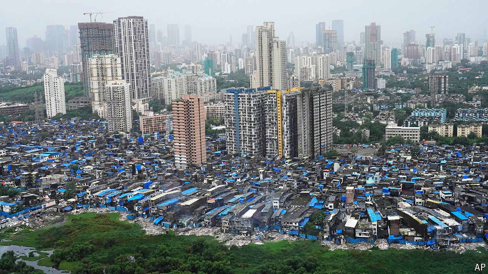

###### What Modi 3.0 may mean

# A weakened Narendra Modi subsidises jobs and doles out pork 

##### The prime minister has had to compromise after a disappointing election 

 

> Jul 23rd 2024 

Narendra Modi, India’s prime minister, was brimming with confidence when his government unveiled an interim budget in February. With a general election a few weeks away, his ruling Bharatiya Janata Party (BJP) was widely expected to retain, and possibly expand, its majority in parliament. Such was his sureness of victory that the mini-budget contained few of the welfare handouts and other sops that often precede Indian elections. It focused instead on trimming the fiscal deficit, improving infrastructure and other measures aimed at a long-term goal to make India a developed country by 2047, the centenary of its independence. 

